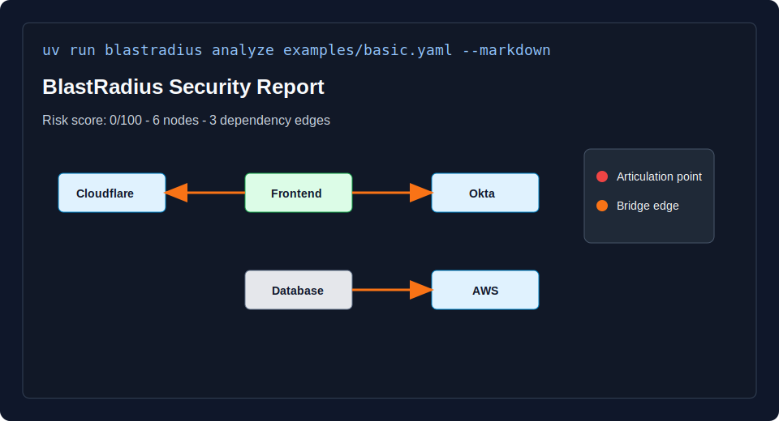

# BlastRadius

BlastRadius is a Python CLI tool that builds infrastructure dependency graphs
and detects single points of failure using graph algorithms.

It models services, databases, DNS providers, identity systems, cloud services,
and external dependencies as a graph. BlastRadius then uses NetworkX analysis to
find articulation points, bridge edges, blast radius, and dependency paths.

The Python package and CLI command remain `chokepoint` for 1.0.0 compatibility.

## Quick Demo

Run the analyzer against one of the included examples:

```bash
uv run chokepoint analyze examples/basic.yaml --markdown
```



The report shows:

- a Mermaid dependency graph
- hidden single points of failure
- confidence labels for findings
- articulation points and bridge edges
- blast radius and dependency chains

## Core Features

- Parses YAML infrastructure dependency files.
- Parses basic Terraform HCL resources.
- Parses basic Docker Compose services and `depends_on` relationships.
- Scans repositories to auto-discover supported topology, Terraform, and Docker
  Compose files.
- Builds a typed topology model with Pydantic.
- Converts infrastructure dependencies into a NetworkX graph.
- Detects articulation points, bridge edges, connected components, cycles, and
  centrality.
- Generates terminal, Markdown, JSON, CSV, Mermaid, and SVG output.
- Labels findings with high, medium, or low confidence so inferred claims can be
  reviewed before action.
- Provides a Click/Rich CLI for local analysis.

## What This Project Demonstrates

BlastRadius is designed as a portfolio-friendly infrastructure graph analyzer. It
demonstrates:

- Python 3.12+ project structure
- typed domain models
- CLI design
- graph algorithms
- parser design
- test coverage and CI
- documentation and project hygiene

## Engineering Baseline

The repository uses modern Python engineering practices:

- `uv` for package and environment management
- `pyproject.toml` as the single project configuration surface
- `src/` package layout
- `pytest` for testing
- `ruff`, `black`, and `mypy` for quality gates
- `pre-commit` hooks
- GitHub Actions CI

## Development

Install the development environment:

```bash
uv sync
```

Run the checks used by CI:

```bash
uv sync
uv run black --check src tests scripts
uv run ruff check src tests scripts
uv run mypy
uv run pytest -q
```

Use `uv run ...` for commands that must work from a completely clean shell. The
project uses a `src/` layout and relies on uv to create the Python 3.12+
environment and install test dependencies before collection.

If you prefer plain commands such as `pytest -q` or `chokepoint analyze ...`,
activate the uv virtual environment first:

```powershell
.\.venv\Scripts\Activate.ps1
pytest -q
chokepoint analyze examples/topology-basic.yaml
```

Install local hooks:

```bash
uv run pre-commit install
```

## CLI

Common commands:

```bash
uv run chokepoint analyze examples/basic.yaml
uv run chokepoint graph examples/basic.yaml --json
uv run chokepoint report examples/basic.yaml --markdown
uv run chokepoint validate examples/basic.yaml
uv run chokepoint export examples/basic.yaml --format mermaid
uv run chokepoint export examples/basic.yaml --format svg
uv run chokepoint diff examples/topology-basic.yaml examples/topology-expanded.yaml --json
uv run chokepoint scan /path/to/repo --markdown
```

`analyze` and `report` explain the topology in terms of a visual dependency
graph, hidden single points of failure, blast radius, and why each risky
dependency matters.

Use `--verbose` before the command for colored diagnostic logs:

```bash
uv run chokepoint --verbose validate examples/topology-basic.yaml
```

## Architecture

The architecture is documented in [Architecture.md](Architecture.md). The
package is organized around independent layers for parsing, graph construction,
domain models, reporting, and the command-line entry point.

The graph engine algorithms and complexity profile are documented in
[docs/graph-engine.md](docs/graph-engine.md).

The supported YAML topology format is documented in
[docs/yaml-parser.md](docs/yaml-parser.md).

Terraform ingestion is documented in
[docs/terraform-parser.md](docs/terraform-parser.md).

Docker Compose ingestion is documented in
[docs/docker-compose-parser.md](docs/docker-compose-parser.md).

Repository auto-discovery is documented in
[docs/repository-scanner.md](docs/repository-scanner.md).

Risk analysis output is documented in [docs/risk-engine.md](docs/risk-engine.md).

Report and topology exports are documented in [docs/exports.md](docs/exports.md).
